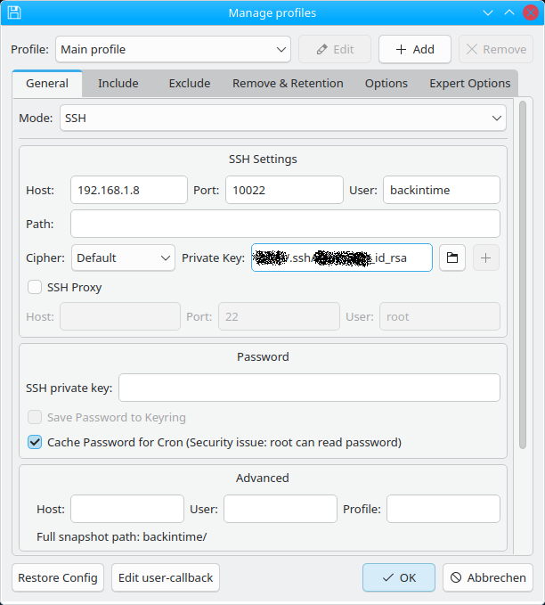
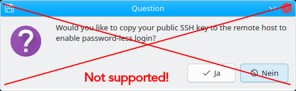

# Backintime-sshd

## Overview

This project provides a docker image containing an SSH server ready-to-go for the backup data of [Back In Time](https://github.com/bit-team/backintime).
Run this container on your remote host (eg. NAS) and no longer depend on the natively installed SSH server and rsync.

This image is based on the work of [https://github.com/Hermsi1337/docker-sshd](https://github.com/Hermsi1337/docker-sshd) but is adapted and simplified to the needs of [Back In Time](https://github.com/bit-team/backintime).

## Prebuild Images

For recent versions are availabe on the [Dockerhub](https://hub.docker.com/repository/docker/caco3x/backintime-sshd).

## Docker Compose
See example in [docker-compose.yaml](docker-compose.yaml)

### Environment variables

| Variable | Explanation |
|:-----------------:|:------------------------------------------------------------------------------------------------------------------------------------:|
| USERNAME | Username on the remote host system and SSH, usually `backintime` |
| PUBLIC_KEY | SSH public key for user authentication |


### Data Persistance
> **Warning**
> It is crutial to make sure that the `backintime` folder is mapped onto the remote hosts filesystem! Disregarding this means that you will lose your data when you delete the docker container! Use the remote hosts filebrowser to validate the new backups are effectively there!

# Preparations on your remote host
The remote host is where your backups will be stored, eg. a designated Linux machine or a NAS. See the [Back In Time documentation](https://backintime.readthedocs.io/en/latest/#ssh) for details.

The following screenshots show the preparations on an Ugreen NAS, but can be adapted to any Linux system.

1. Create a normal user on the remote host. Ideally call it `backintime`:

    

1. Install the docker app:

    

1. Create a new docker compose project (Use to the example [Docker Compose file](docker-compose.yaml)):
    

1. Add the SSH Public Key to the `PUBLIC_KEY` variable (replace the example key).

1. If you did not use `backintime` for the user name, you must set the correct name in `USERNAME` and in the mount path!

## Move your existing backups
The next steps only apply if you already have existing [Back In Time](https://github.com/bit-team/backintime) backups.

1. Move your existing backups to the new location on the remote host.
1. Make sure the access rights and owner of the existing backup data is set correctly. This can eg. be done with the following commands (`/volume1/backintime` refers to the backup data location):
    ```bash
    sudo chown backintime:users /volume1/backintime -R
    sudo chmod 755 /volume1/backintime“
    ```

1. Start the container.

1. On your PC, resp. the device which runs the Back In Time application, run the following command to make sure the password-less SSH connection is possible:
    ```bash
    ssh -i /path/to/the/id_rsa/file backintime@remote-host-ip -p 10022
    ``` 
    Replace `/path/to/the/id_rsa/file` with the path to your private key and `remote-host-ip` with the IP address of your remote host.
    
    If it is the first time you connect to this SSH host, you will have to confirm the authenticity:
    ```bash
    The authenticity of host '[192.168.1.8]:10022 ([192.168.1.8]:10022)' can't be established.
    ED25519 key fingerprint is SHA256:AFkKsBidxbeZ/VIuKkyckXL4Jn0EPZIpKMhAPDgtpkI.
    This key is not known by any other names.
    Are you sure you want to continue connecting (yes/no/[fingerprint])?
    ```
    
    Type `yes` and press `Enter`.

    You then should see the following welcome screen:
    ```bash
    Welcome on the remoste host for Back In Time.

    If you were able to log in without using a password, all is set up correctly.

    You may exit the SSH connection again by pressing `CTRL-D`.

    See for more details see https://github.com/caco3/backintime-sshd/blob/main/README.md.
    ```

1. To confirm the backup data is mounted correctly into the docker container, run
    ```bash
    ls -l backintime
    ```

    You should see a list of all existing backups (example):
    ```bash
    drwxrwxrwx    3 backintime users         4096 Jan 10 21:03 20260110-220001-751
    drwxrwxrwx    3 backintime users         4096 Jan 11 21:03 20260111-220002-751
    drwxrwxrwx    3 backintime users         4096 Jan 11 21:19 20260111-221825-751
    drwxr-xr-x    3 backintime users         4096 Jan 14 23:38 20260115-003523-751
    drwxr-xr-x    3 backintime users         4096 Jan 15 21:03 20260115-220006-751
    drwxr-xr-x    3 backintime users         4096 Jan 16 20:09 20260116-210620-751
    drwxrwxrwx    3 backintime users         4096 Jan 16 22:01 20260116-225831-751
    drwxrwxrwx    3 backintime users         4096 Jan 17 18:46 20260117-194211-751
    lrwxrwxrwx    1 backintime users            1 Dec  9 21:35 backintime -> .
    lrwxrwxrwx    1 backintime users           19 Jan 17 18:46 last_snapshot -> 20260117-194211-751
    ```

1. The remote host is now setup correctly and you can exit the connection by pressing `CTRL-D`.

# Configuration in the Back In Time application
1. Setup [Back In Time](https://github.com/bit-team/backintime) as normal. 

    Below are the required parameters for the remote host documented:
    - Hostname: `remote-host-ip`
    - Port: `10022`
    - User: `backintime`
    - Key: `/path/to/the/id_rsa/file`

    

# Limitations
Since the public SSH key gets provided through the Docker compose configuration, it is not possible for [Back In Time](https://github.com/bit-team/backintime) to transmit it on the initial setup.



How ever this is not required anyway when the docker container is setup correctly.
